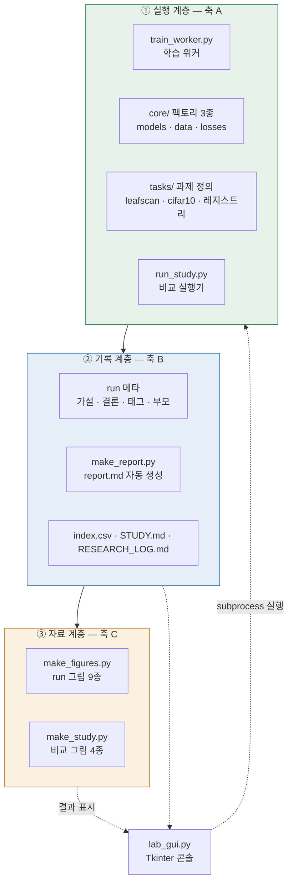
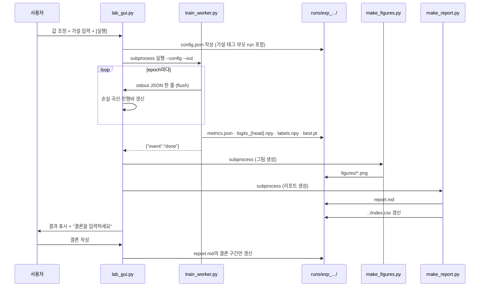
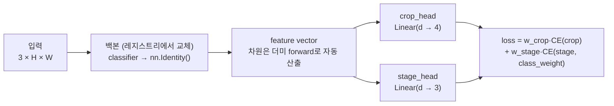
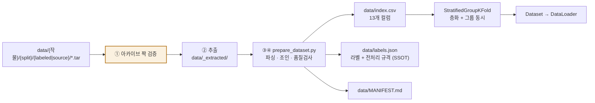

# LeafScan 구조도

> 기획서(`01_기획서.md`)가 정의한 목표를 **어떤 구조로 구현하는가**.
> 사용법은 `03_시작하기.md`에 있다.

---

## 1. 전체 구조 — 3층



| 계층 | 역할 | 없으면 |
|---|---|---|
| ① 실행 | 실험이 돌아간다 | 아무것도 안 됨 |
| ② 기록 | 실험이 **의미로 남는다** | run 30개가 숫자 더미가 됨 |
| ③ 자료 | 실험이 **보여줄 수 있는 것으로 남는다** | 자료 만들 때 스크린샷 노가다 |

**의존 방향은 아래에서 위로 단방향이다.** 학습 코드는 report가 생성되는 것을 모르고, report 생성기는 그림 생성기를 모른다. 각각 run 디렉터리의 **파일만** 읽고 쓴다.

> **이 무의존 구조의 실익** — 그림 생성이 실패해도 학습 결과는 남는다. matplotlib 오류로 40분짜리 학습이 무효가 되는 일이 없다.

---

## 2. 실행 흐름



**GUI는 학습 로직을 소유하지 않는다.** 화면 값을 config로 쓰고, 별도 프로세스를 띄우고, 결과 파일을 읽어 보여줄 뿐이다. 따라서 GUI 없이 터미널에서 동일 실험이 그대로 재현된다.

---

## 3. 디렉터리 구조

```
LeafScan/
├─ README.md
├─ requirements.txt              # 버전 고정
│
├─ check_env.py                  # 설치 환경 확인
├─ train_worker.py               # 학습 진입점 (얇음)
├─ run_study.py                  # 비교 실행기 (여러 arch 순차 실행)
├─ make_figures.py               # 그림 생성 (별도 프로세스)
├─ make_report.py                # 리포트 생성
├─ lab_gui.py                    # Tkinter 콘솔
│
├─ scripts/                      # 단독 실행 도구 (루트에서 python scripts/xxx.py)
│  ├─ setup_data_dirs.py         #   최초 설치 시 data/ 뼈대 생성
│  ├─ prepare_dataset.py         #   데이터 인제스트 (tar → index.csv)
│  ├─ check_data.py              #   데이터 버전·무결성 확인
│  ├─ make_study.py              #   study 비교 그림 4종
│  └─ make_bundle.py             #   앱 인계용 번들 생성
│
├─ core/                         # ★ 과제 중립 — 다른 프로젝트에 그대로 재사용
│  ├─ config.py                  #   스키마 검증 · 마이그레이션
│  ├─ models.py                  #   build_model · MultiHeadNet
│  ├─ data.py                    #   build_data · transforms · 분할
│  ├─ losses.py                  #   build_criterion · class weight
│  ├─ metrics.py                 #   지표 계산
│  ├─ figures.py                 #   그림 렌더 (matplotlib)
│  ├─ report.py                  #   report.md 생성 · 자동 관찰 규칙
│  └─ tracking.py                #   MLflow / wandb 래퍼
│
├─ tasks/                        # ★ 과제 고유 — 여기만 바꾸면 다른 문제로 전환
│  ├─ models_registry.py         #   ModelSpec 6종
│  ├─ leafscan.py                #   라벨 체계 · 목표값 · 프리셋
│  └─ cifar10.py                 #   재사용성 증명 + 회귀 픽스처
│
├─ configs/
│  ├─ base_leafscan.json         # 비교 실험의 기준 설정
│  └─ smoke_*.json               # 모델별 스모크 설정
│
├─ tests/
│  ├─ golden/                    # 회귀 기준선
│  ├─ test_regression.py
│  └─ test_matrix.py             # arch × dataset 조합 검증
│
├─ data/                         # ★ Git 제외 — 04_팀_협업_규약.md 참조
│  ├─ lettuce/ chard/ kale/ leaf_mustard/     # 원본 tar (작물별)
│  │  └─ {training|validation}/{labeled|source}/*.tar
│  ├─ _extracted/                # tar 추출본
│  ├─ index.csv                  # 학습이 읽는 유일한 정의
│  ├─ labels.json
│  └─ MANIFEST.md
│
├─ runs/                         # 실험 결과
└─ bundles/                      # 앱 인계용 번들
```

### 3.1 `core/` 와 `tasks/` 를 나눈 이유

| | `core/` | `tasks/` |
|---|---|---|
| 아는 것 | 텐서·손실·지표·그림 | 상추·정식기·목표 F1 |
| 모르는 것 | **이 프로젝트가 무엇을 분류하는지** | 학습 루프의 내부 |
| 다른 과제로 옮길 때 | 그대로 복사 | 새로 작성 |

`tasks/cifar10.py`를 남겨두는 것은 **"같은 하네스로 두 과제가 돌아간다"는 증거**이자, 회귀 테스트의 픽스처다.

---

## 4. 모델 레지스트리 — 모델 카드 방식

**모델 교체를 유연하게 만드는 핵심 설계.** 레지스트리 항목을 생성자 함수가 아니라 **명세 객체**로 둔다. 학습·CAM·그림·리포트가 모두 이 객체만 읽으므로, 새 모델을 추가할 때 **다른 파일을 전혀 건드리지 않는다.**

```python
@dataclass(frozen=True)
class ModelSpec:
    build:           Callable[[bool], nn.Module]  # pretrained 여부를 받아 백본 생성
    feature_dim:     int | None    # None이면 더미 텐서 forward로 자동 산출
    default_size:    int           # 권장 입력 해상도
    norm:            tuple         # 정규화 상수 (ImageNet / 0.5)
    cam:             CamSpec       # Grad-CAM 대상 레이어 + 후처리
    params_m:        float         # 파라미터 수 (백만)
    suggested_lr:    tuple         # lr 탐색 시작 3점
    suggested_batch: dict          # VRAM별 권장 배치 {4: 16, 8: 32, 12: 64}
    notes:           str
```

### 4.1 등록 모델

| key | 계열 | params | default_size | lr 탐색 3점 | 권장 batch (4/8GB) |
|---|---|---|---|---|---|
| `resnet50` | CNN 표준 | 25.6M | 224 | 3e-4 / 1e-3 / 3e-3 | 16 / 32 |
| `efficientnet_b0` | CNN 효율 | 5.3M | 224 | 3e-4 / 1e-3 / 3e-3 | 32 / 64 |
| `convnext_tiny` | CNN 최신 | 28.6M | 224 | 1e-4 / 3e-4 / 1e-3 | 16 / 32 |
| `resnet18` | CNN 경량 | 11.7M | 224 | 1e-3 / 3e-3 / 1e-2 | 32 / 64 |
| `mobilenet_v3_small` | CNN 초경량 | 2.5M | 224 | 1e-3 / 3e-3 / 1e-2 | 64 / 128 |
| `simple_cnn` | 픽스처 | 0.1M | 32 | 1e-3 | 128 / 256 |

> ConvNeXt의 lr 범위가 낮은 것은 의도적이다. Transformer 계열 학습 방식을 따르는 모델이라 큰 lr에서 발산하기 쉽다. 레지스트리에 담아두면 사용자가 이를 몰라도 된다.

### 4.2 새 모델 추가 — 3단계

```python
# 1) tasks/models_registry.py 에 항목 추가
"efficientnet_b2": ModelSpec(
    build=lambda pre: tv.efficientnet_b2(
        weights="IMAGENET1K_V1" if pre else None),
    feature_dim=None, default_size=260, norm=IMAGENET_NORM,
    cam=CamSpec(layer="features.-1"),
    params_m=9.1, suggested_lr=(3e-4, 1e-3, 3e-3),
    suggested_batch={4: 16, 8: 32}, notes="B0 대비 정확도 우위, 연산 1.9배"),
```

```bash
# 2) 스모크 실행 (1 epoch, 더미 데이터)
python train_worker.py --config configs/smoke_template.json \
    --set arch=efficientnet_b2 --out runs/_smoke

# 3) 조합 매트릭스에 자동 편입 — 별도 작업 없음
pytest tests/test_matrix.py
```

**다른 파일은 수정하지 않는다.** 이것이 축 A의 실질이다.

### 4.3 Grad-CAM을 레지스트리에 넣는 이유

계열마다 CAM 대상 레이어와 후처리가 다르다.

| 계열 | 대상 | 후처리 |
|---|---|---|
| ResNet | `layer4[-1]` | 없음 |
| EfficientNet / MobileNet | `features[-1]` | 없음 |
| ConvNeXt | 마지막 stage (LayerNorm 이전) | 채널 순서 주의 |

이 차이를 `CamSpec`에 담아두면 **그림 생성 코드는 arch를 몰라도 된다.** 새 모델을 추가할 때 CAM 코드를 고치지 않는다.

---

## 5. 모델 구조 — 멀티헤드



```python
class MultiHeadNet(nn.Module):
    def __init__(self, backbone, in_features, heads: dict[str, int]):
        super().__init__()
        self.backbone = backbone
        self.heads = nn.ModuleDict({k: nn.Linear(in_features, n)
                                    for k, n in heads.items()})

    def forward(self, x):
        feat = self.backbone(x).flatten(1)
        return {k: h(feat) for k, h in self.heads.items()}   # logit만 반환
```

| 규칙 | 이유 |
|---|---|
| head는 **logit만** 반환 | `CrossEntropyLoss`가 log-softmax를 수행. 중복 적용 시 학습이 망가짐 |
| 단일 head도 dict로 처리 | 분기를 두 벌 만들면 한쪽만 고치는 버그가 생김 |
| feature 차원 자동 산출 | 백본마다 다르고, 해상도에 따라서도 달라짐 |

---

## 6. 데이터 파이프라인

> 데이터 구조·JSON 스키마·함정의 상세는 **`05_데이터_명세서.md`**. 여기서는 코드 구조만 다룬다.



| 단계 | 규칙 |
|---|---|
| **짝 검증** | `labeled`·`source`의 묶음 번호가 다르면 **중단**. 교집합 0건이 조용히 지나가는 것을 막는다 |
| 추출 | `data/_extracted/`. 이미 추출된 아카이브는 건너뜀. tar 직접 읽기는 랜덤 액세스가 느려 채택하지 않음 |
| 조인 | JSON ↔ JPG를 **파일명 stem**으로. JSON의 `fname` 필드는 실제 파일명이 아니므로 쓰지 않는다 |
| 인덱스 | **학습은 `index.csv`만 읽는다.** 원본 JSON을 직접 파싱하지 않음 |
| **분할** | **`StratifiedGroupKFold`** — 층화(작물×단계 12조합)와 그룹(개체)을 동시에 만족시켜야 함 |
| `group_id` | `{crops_id}_{개체번호}`. JSON의 `crops_id` 필드 사용, **파일명 파싱 금지**(길이가 일정하지 않음) |
| `split_policy` | `respect_provided`(기본) / `resplit_all` — study 00에서 결정 |
| 분할 고정 | study 단위로 `split.json`에 1회 저장 후 재사용 → **비교 공정성 보장** |
| `crop_mode` | `full` / `bbox` / `bbox_expand` — 입력 crop 방식도 실험 변수 |
| ambiguous | 정책 3종: `exclude` / `downweight` / `include` |
| transform | train(augmentation 포함) / eval(리사이즈+정규화만) 분리 |

### 6.1 왜 `StratifiedGroupKFold`인가

이 데이터는 두 제약이 충돌한다.

| 제약 | 이유 |
|---|---|
| 그룹 분할이 필요하다 | 한 개체를 한 달간 27~40장 연속 촬영 → 같은 개체가 양쪽에 섞이면 성능이 크게 과대평가된다 |
| 층화 분할이 필요하다 | **한 아카이브에 한 단계만 있는 경우가 실제로 존재** → 그룹 단위로만 자르면 단계 균형이 무너진다 |

`GroupShuffleSplit`는 층화를 못 하고, `train_test_split(stratify=…)`는 그룹을 못 지킨다. **둘을 동시에 처리하는 것은 `StratifiedGroupKFold` 뿐이다.**

---

## 7. run 디렉터리 규약

```
runs/
├─ index.csv                        # 전체 run 카탈로그 (자동 갱신)
├─ RESEARCH_LOG.md                  # 연구 서사 인덱스
│
├─ study_01_backbone/
│  ├─ STUDY.md                      # 비교 결론
│  ├─ split.json                    # 고정된 분할 (공정성)
│  └─ figures/
│     ├─ cost_accuracy.png          # 비용 vs 정확도 산점도
│     ├─ loss_overlay.png
│     ├─ runs_parallel.png
│     └─ metric_progress.png
│
└─ exp_260815_jk_07/
   ├─ config.json                   # 설정 + 가설 + 태그 + parent_run
   ├─ diff.json                     # 부모 run과의 차이 (자동)
   ├─ env.json                      # torch/GPU/데이터해시/커밋
   ├─ status.json                   # state · epoch · pid · failure_kind
   ├─ train.log                     # stdout 원문
   ├─ metrics.json                  # head별 지표 + history
   ├─ logits_crop.npy               # 예측값 (threshold 재계산용)
   ├─ logits_stage.npy
   ├─ labels.npy
   ├─ best.pt                       # state_dict만
   ├─ report.md                     # 자동 생성 리포트
   └─ figures/                      # 그림 9종
```

### 7.1 학습 워커가 지켜야 할 계약

| # | 계약 | 위반 시 |
|---|---|---|
| **C1** | 모든 설정을 `--config` 하나로 받는다 (하드코딩 금지) | GUI가 제어할 수 없는 값이 생김 |
| **C2** | 모든 출력을 `--out` 아래에만 쓴다 | run 간 결과 덮어쓰기 |
| **C3** | epoch마다 JSON 한 줄을 `flush=True`로 출력 | 로그가 버퍼에 갇혀 진행이 안 보임 |
| **C4** | 종료 시 `metrics.json`·`logits_*.npy`·`labels.npy`·`status.json`을 남긴다 | 결과를 화면에 못 띄움 |
| **C5** | 그림·리포트를 생성하지 않는다 | 그림 실패가 학습을 무효화함 |

### 7.2 로그 프로토콜

사람이 읽는 로그를 정규식으로 파싱하지 않는다. 기계용 JSON 라인을 별도로 낸다.

| event | 필드 | 콘솔 동작 |
|---|---|---|
| `start` | total_epochs, arch, heads, device | 진행바 초기화 |
| `epoch` | epoch, loss, val_loss, 지표 | 곡선 점 추가 |
| `stage` | name (`freeze_release` 등) | 곡선에 수직선 표시 |
| `done` | run_id, metrics | 결과 로드 |
| `error` | message, traceback, kind | 실패 표시 |

---

## 8. `report.md` 구조

학습 종료 시 자동 생성. **사람이 채우는 칸은 3곳뿐.**

| § | 섹션 | 생성 |
|---|---|---|
| — | 헤더 (run id, study, 부모, 소요, 태그) | 자동 |
| 1 | **가설** — 왜 이 실험을 하는가 | **사람 (실행 전)** |
| 2 | 무엇을 바꿨나 — 부모 run과의 config diff | 자동 |
| 3 | 설정 요약 | 자동 |
| 4 | 결과 — 지표 표(델타·목표) + head별 클래스 P/R/F1 | 자동 |
| 5 | 그림 — `figures/` 임베드 | 자동 |
| 6 | **자동 관찰** — 규칙 기반 사실 지적 | 자동 |
| 7 | **결론** — 해석 | **사람 (실행 후)** |
| 8 | 다음 실험 제안 — 후보 자동, 채택 사람 | 반반 |
| 9 | 재현 정보 — 명령·버전·GPU·해시·커밋 | 자동 |

### 8.1 자동 관찰 규칙

| 규칙 | 조건 | 출력 예 |
|---|---|---|
| 최약 클래스 | 클래스 F1 최솟값이 macro보다 0.10 이상 낮음 | 🔴 정식기 recall이 가장 낮음 |
| 과적합 | val_loss가 N epoch 연속 상승 | 🟡 epoch 15부터 상승 |
| 트레이드오프 | accuracy↓ + macro-F1↑ | 🟡 다수 클래스를 희생하고 소수를 얻음 |
| 오분류 편중 | 특정 방향이 60% 초과 | 🔴 정식기→생육기 71% 단방향 |
| 학습 실패 | loss가 NaN 또는 초기값 유지 | 🔴 학습이 진행되지 않음 |

> **판단하지 않고 사실만 짚는다.** 자동 규칙이 "이렇게 하세요"까지 말하면 사람이 생각을 멈춘다. 해석(§7)은 사람의 몫이다.

### 8.2 갱신 방식

사람이 결론을 쓰면 **해당 섹션만** 갱신한다. 앵커로 구간을 나눠 자동 생성부와 사람 작성부가 서로를 덮어쓰지 않게 한다.

```markdown
<!--auto:results-start--> … 재생성 시 교체 <!--auto:results-end-->
<!--fill:conclusion-start--> … 사람이 쓴 것, 보존 <!--fill:conclusion-end-->
```

---

## 9. 그림 목록

### run 단위 (9종)

| 그림 | 내용 |
|---|---|
| `data_distribution.png` | 12조합 장수 + 분할 후 비율 (**학습 전**에 봐야 함) |
| `confusion_{head}.png` | head별 혼동행렬 (미판정 열 포함) |
| `loss_curve.png` | train/val + best epoch + freeze 해제 시점 |
| `f1_per_class.png` | 클래스별 F1, 기준 run 대비 나란히 |
| `calibration.png` | 신뢰도 구간별 실제 정확도 → threshold 근거 |
| `confidence_hist.png` | 판정/보류 분포 |
| `misclassified_grid.png` | 오분류 상위 12장 실제 이미지 |
| `gradcam_samples.png` | 모델이 보는 영역 (arch별 CamSpec) |
| `embedding_tsne.png` | 특징 공간 클래스 분리도 |

### study 단위 (4종)

| 그림 | 내용 |
|---|---|
| `cost_accuracy.png` | 파라미터·연산량 vs macro-F1 산점도 |
| `loss_overlay.png` | 여러 arch의 손실 곡선 겹치기 |
| `runs_parallel.png` | 평행좌표 — 설정과 지표의 관계 |
| `metric_progress.png` | 실험 순서에 따른 지표 추이 |

### 9.1 렌더링 역할 분리

| 용도 | 도구 | 이유 |
|---|---|---|
| 화면 (콘솔 내부) | **Tk Canvas** | 즉시 반응(50ms), 의존성 없음 |
| 저장 (`figures/`) | **matplotlib** | 해상도·폰트·레이아웃 제어, 발표 품질 |

두 경로는 **같은 계산 결과를 공유**하고 렌더러만 다르다. 지표 계산 코드는 한 벌이다.

---

## 10. 콘솔 구조

**좌측은 손, 우측은 눈.** 조작은 전부 왼쪽, 결과는 전부 오른쪽.

| 영역 | 구성 | 반응 |
|---|---|---|
| 전역 바 | 프로젝트·기준 run·상태 배지 | — |
| ① 데이터 | 데이터셋 선택, 경로, 샘플 수, [고급] 분할·ambiguous 정책 | 재학습 |
| ② 모델 | **arch 세그먼트**, 입력 해상도, pretrained, 헤드 구성(자동), [고급] simple_cnn 파라미터 | 재학습 |
| ③ 학습 | epochs, batch, lr(로그), freeze, head 가중치, class weight, [고급] optimizer·seed·추적 | 재학습 |
| ④ 실행 | **가설 입력**, 예상 시간, 경고, 실행/중단 | — |
| ⑤ 지표 카드 | stage macro-F1 · 정식기 recall · crop acc · 미판정률 (기준 대비 델타) | 즉시 |
| ⑥ 혼동행렬 | **head 탭 전환**, 미판정 열, 셀 클릭 | 즉시 |
| ⑦ 샘플 그리드 | 선택 셀의 오분류 이미지 | 즉시 |
| ⑧ 학습 진행 | 진행바·손실곡선·로그 콘솔 | 스트리밍 |
| ⑨ 결론 입력 | 결과 하단, `report.md`에 반영 | — |
| ⑩ 비교 탭 | N개 run 체크 → 지표 표 + 평행좌표 | 즉시 |

**초기 노출 제한** — 처음 보이는 조작 대상은 7개 이하로 유지한다. 나머지는 `고급` 아코디언에 격리.

**threshold 즉시 반응의 조건** — `logits_{head}.npy`를 최초 1회 메모리에 로드하고, 이후 threshold 변경은 numpy 마스크 재집계로만 처리한다. 모델 재추론이 개입하는 순간 즉시성이 붕괴한다.

---

## 11. 비교 실행기 (`run_study.py`)

```bash
python run_study.py --study study_01_backbone \
  --base configs/base_leafscan.json \
  --vary arch=resnet50,efficientnet_b0,convnext_tiny,resnet18,mobilenet_v3_small \
  --lr-search
```

| 보장 | 방법 |
|---|---|
| 데이터 동일성 | 인덱스 해시를 study에 기록, run마다 대조 |
| 분할 동일성 | `split.json`을 1회 생성 후 전 run이 재사용 |
| 조건 누락 방지 | base config에서 arch·lr·batch만 오버라이드 허용, 그 외 변경 시 경고 |
| lr 공정성 | arch별 3점 탐색(예산 30%) → 최적 lr로 본 실험 |
| 중단 복구 | 완료된 run은 건너뛰고 남은 것만 실행 |
| 팀 분담 | `--only arch=convnext_tiny`로 일부만 실행 가능 |

---

## 12. 확장점

| 확장 | 상태 | 바뀌는 것 |
|---|---|---|
| 새 모델 추가 | 즉시 가능 | 레지스트리 한 항목 |
| 새 데이터셋 | 즉시 가능 | `DATASET_REGISTRY` 한 항목 |
| 다른 분류 과제 | 즉시 가능 | `tasks/` 파일 하나 |
| 객체 탐지 | 확장점만 확보 | 데이터 로더(bbox) · 손실 · 지표(mAP) · 그림(박스) |
| 이미지 분할 | 확장점만 확보 | 마스크 로더 · Dice/IoU · 그림(마스크) |

> 탐지·분할은 보유 데이터에 bbox 어노테이션이 있어 경로가 열려 있지만, **지금 착수하지 않는다.** 분류가 안정된 뒤 재검토한다.
