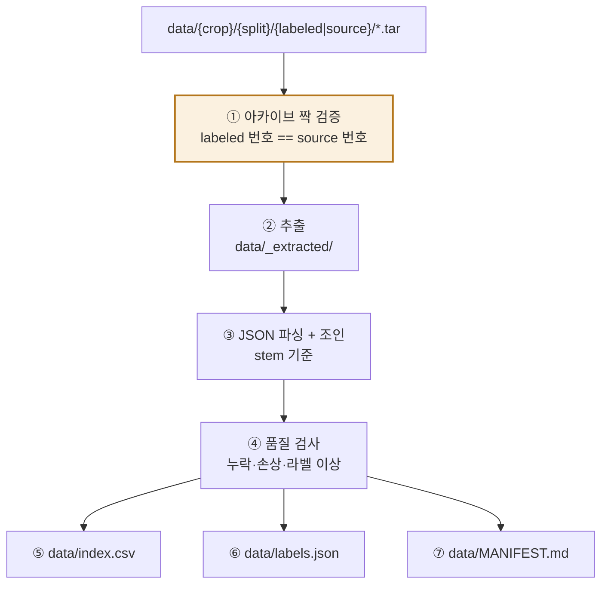

# LeafScan 데이터 명세서

> 실제 배포 데이터 **AI 허브 [수직농장 통합데이터(엽채류)](https://aihub.or.kr/aihubdata/data/view.do?currMenu=115&topMenu=100&aihubDataSe=data&dataSetSn=595)** 의 구조를 **실측**하고, 학습 파이프라인이 이를 어떻게 흡수하는지 정의합니다.
> 기획서·구조도·구현계획서의 데이터 관련 서술은 모두 이 문서를 따릅니다.
>
> **실측 기준**: `data/lettuce/` 샘플 4개 아카이브 (2026-08 확인)

---

## 1. 디렉터리 구조

```
data/
├─ lettuce/          # 상추
├─ chard/            # 근대
├─ kale/             # 케일
└─ leaf_mustard/     # 겨자채
   ├─ training/
   │  ├─ labeled/    TL_3.{작물}{NN}.tar    ← 어노테이션 JSON
   │  └─ source/     TS_3.{작물}{NN}.tar    ← 원본 이미지 JPG
   └─ validation/
      ├─ labeled/    VL_3.{작물}{NN}.tar
      └─ source/     VS_3.{작물}{NN}.tar
```

| 폴더명 | 작물 | JSON의 `crops` 값 |
|---|---|---|
| `lettuce` | 상추 | `상추` |
| `chard` | 근대 | `근대` |
| `kale` | 케일 | `케일` |
| `leaf_mustard` | 겨자채 | `겨자채` |

### 1.1 아카이브 명명 규칙

```
TL_3.상추32.tar   →  Training  / Labeled / 상추 / 32번 묶음
TS_3.상추32.tar   →  Training  / Source  / 상추 / 32번 묶음
VL_3.상추10.tar   →  Validation/ Labeled / 상추 / 10번 묶음
VS_3.상추10.tar   →  Validation/ Source  / 상추 / 10번 묶음
```

| 접두 | 의미 |
|---|---|
| `TL` / `TS` | Training Labeled / Training Source |
| `VL` / `VS` | Validation Labeled / Validation Source |
| 끝 숫자 | **묶음 번호 — labeled와 source가 반드시 같아야 합니다** |

> ⚠️ **현재 샘플의 문제** — `lettuce/training/`에 `TL_3.상추**32**.tar`와 `TS_3.상추**42**.tar`가 들어 있습니다. 번호가 달라 **두 파일의 교집합이 0건**이다(실측). 라벨 500건, 이미지 500건인데 서로 짝이 하나도 없습니다.
> `validation/`은 `VL_3.상추10` ↔ `VS_3.상추10`으로 번호가 같고 **177건이 완전히 일치**합니다.
> → **`TS_3.상추32.tar`를 다시 받아야 합니다.** 파이프라인에도 이 검사를 넣는다(§6.1).

---

## 2. 아카이브 내부

```
TL_3.상추32.tar
└─ TL_3.상추32/
   ├─ C17_L01_01_006_510696.json
   ├─ C17_L01_01_011_484678.json
   └─ …  (500건)

TS_3.상추32.tar
└─ TS_3.상추32/
   ├─ C17_L01_01_006_510696.jpg
   └─ …  (500건)
```

**JSON과 JPG는 파일명 stem이 완전히 동일합니다.** 이것이 유일한 연결 키입니다.

```
stem = {crops_id}_{개체번호}_{image_id}

C46_L01     _04_004     _771218
└ crops_id  └ 개체번호  └ image_id
```

| 주의 | 내용 |
|---|---|
| `crops_id` 길이가 일정하지 않습니다 | `C17_L01_01`(3토막) / `C46_L01`(2토막) 혼재 → **파일명 파싱으로 crops_id를 추출하지 말 것.** JSON의 `crops_id` 필드를 씁니다 |
| JSON 내부 `fname`은 다른 이름 | `C46_L01_004_220111101903.jpg` (촬영시각 기반) — **실제 파일명이 아닙니다.** 조인에 쓰지 말 것 |
| stem 끝은 항상 `image_id` | 실측 177/177 일치 |

---

## 3. 어노테이션 JSON 구조

```jsonc
{
  "images": {
    "image_id": 484678,
    "farm_id": "AIF003",
    "crops_id": "C17_L01_01",        // ★ 그룹 키의 상위 부분
    "crops": "상추",                  // ★ 작물 라벨
    "kind_type": "햇살적축면",         //   품종 (아카이브 단위로 고정)
    "file_path": "/cropsImages/…",
    "fname": "C17_L01_01_011_210911214650.jpg",   // ⚠️ 실제 파일명 아님
    "fext": "jpg",
    "width": "1243", "height": "898",  // ⚠️ 문자열 타입
    "create_date": "2021-11-15",
    "date_captured": "2021-09-11 21:46:50",
    "growth_stage": "생육기",          // ★ 생육단계 라벨
    "leaf": "0", "plant_body": "1"
  },
  "envrionments": [ { "ti_value":"21.0", "hi_value":"58.0", … } ],  // (원문 오타)
  "growth_index":  { "stem_length": null, "leaf_cnt": null, … },
  "annotations": [ { "segmentation":[…], "bbox":[x,y,w,h], "category_id":0 } ],
  "categories":  [ { "id":0, "name":"주" } ]
}
```

### 3.1 학습에 쓰는 필드

| 필드 | 용도 | 비고 |
|---|---|---|
| `crops` | **작물 라벨 (head 1)** | 폴더명과 교차 검증 |
| `growth_stage` | **생육단계 라벨 (head 2)** | 정식기 / 생육기 / 수확기 |
| `crops_id` + 개체번호 | **group_id** | 데이터 누수 방지 |
| `kind_type` | 품종 — 분석 축 | 아카이브 단위로 고정 → 그룹과 교락 |
| `date_captured` | 시계열 분석·경과일 | 2차 확장용 |
| `width`/`height` | 해상도 통계 | **문자열이므로 int 변환 필요** |
| `annotations[].bbox` | 선택적 crop | §7 참조 |

### 3.2 쓰지 않는 필드

| 필드 | 이유 |
|---|---|
| `envrionments` | 앱에서 입력 불가 (문제 정의상 이미지만 사용) |
| `growth_index` | 샘플에서 전부 `null`. 라벨 검수 참고용으로만 |
| `segmentation` | 분류 문제에서 불필요 |
| `fname` | 실제 파일명이 아님 — 혼동 유발 |

---

## 4. 실측 통계 (lettuce 샘플)

| 아카이브 | 건수 | crops_id | 품종 | 생육단계 분포 |
|---|---|---|---|---|
| `VL_3.상추10` | 177 | `C46_L01` | 로메인 | 생육기 130 · 정식기 36 · 수확기 11 |
| `TL_3.상추32` | 500 | `C17_L01_01` | 햇살적축면 | **생육기 500 (단일 단계)** |

### 4.1 여기서 드러난 세 가지 사실

| # | 사실 | 파이프라인에 미치는 영향 |
|---|---|---|
| **F1** | **한 아카이브 = 한 crops_id = 한 품종** | 아카이브가 사실상 그룹 단위입니다. 여러 아카이브를 모아야 데이터셋이 됩니다 |
| **F2** | **아카이브마다 단계 분포가 극단적으로 다릅니다** (한 단계만 있는 경우 존재) | 아카이브 단위로 자르면 **단계 균형이 무너집니다** → 단순 그룹 분할 불가 (§5) |
| **F3** | 한 개체를 **약 한 달간 연속 촬영** (2021-12-21 ~ 2022-01-21, 27~40장) | 같은 개체 이미지는 서로 매우 유사 → **무작위 분할 시 심각한 누수** |

### 4.2 개체 단위 구조 (VL_3.상추10)

| 개체번호 | 장수 | 생육기 | 정식기 | 수확기 |
|---|---|---|---|---|
| `04_002` | 27 | 24 | 0 | 3 |
| `04_003` | 40 | 29 | 8 | 3 |
| `04_004` | 36 | 23 | 11 | 2 |
| `04_005` | 40 | 29 | 9 | 2 |
| `04_006` | 34 | 25 | 8 | 1 |

> 개체 하나가 정식기 → 생육기 → 수확기를 **시간에 따라 통과**합니다. 이것이 이 데이터의 본질이며, 생육정지 구간의 모호함도 여기서 나옵니다.

### 4.3 해상도

| 항목 | 실측 |
|---|---|
| 범위 | 620×664 ~ 2551×2546 |
| 종횡비 | 약 0.65 ~ 1.5 (대체로 정사각에 가까움) |
| 고정 해상도 | **없음** — 리사이즈 정책이 필요 |

---

## 5. 분할 정책 — 이 데이터의 핵심 난제

F2와 F3이 충돌합니다.

| 요구 | 이유 | 방법 |
|---|---|---|
| **그룹 분할** | 같은 개체가 train/val에 섞이면 성능이 크게 과대평가됩니다 (F3) | 개체 단위로 통째 배정 |
| **층화 분할** | 단계 비율이 train/val에서 유지돼야 평가가 의미 있습니다 | 클래스 비율 유지 |

두 요구를 동시에 만족시켜야 하므로 **`StratifiedGroupKFold`** 를 씁니다. (단순 `GroupShuffleSplit` + `stratify` 조합으로는 불가능합니다.)

```python
from sklearn.model_selection import StratifiedGroupKFold
# y = crop×stage 조합 라벨, groups = group_id
```

### 5.1 group_id 정의

```
group_id = f"{crops_id}_{개체번호}"     예: C46_L01_04_004
```

| 후보 | 평가 |
|---|---|
| `crops_id`만 | 너무 거침 — 아카이브 전체가 한 덩어리라 분할 자유도가 사라짐 |
| **`crops_id` + 개체번호** | **채택** — 개체 단위. 누수를 막으면서 분할 자유도 확보 |
| 파일명 앞부분 파싱 | ❌ crops_id 길이가 일정하지 않아 위험 |

### 5.2 제공된 training / validation 을 쓸 것인가

데이터셋이 이미 `training/`·`validation/`으로 나뉘어 있지만, **아카이브 단위 분할이라 단계 균형이 보장되지 않습니다** (F2 — training 샘플은 생육기 100%).

`split_policy` 를 config 옵션으로 둡니다.

| 정책 | 동작 | 언제 |
|---|---|---|
| `respect_provided` (기본) | val = `validation/` 폴더, test = `training/`에서 그룹 단위로 분리 | 아카이브 수가 충분하고 단계 분포가 납득 가능할 때 |
| `resplit_all` | 전체를 모아 `StratifiedGroupKFold`로 70:15:15 | 제공 분할의 단계 균형이 심하게 깨져 있을 때 |

**어느 쪽이든 `split_source` 컬럼에 원래 출처를 기록**해, 나중에 비교할 수 있게 합니다.

> **study 00에서 반드시 확인할 것** — 전체 아카이브를 수집한 뒤 제공 분할의 단계 분포를 보고 정책을 결정합니다. 샘플만으로는 판단할 수 없습니다.

---

## 6. 인제스트 파이프라인



명령:

```bash
python scripts/prepare_dataset.py --data-root data --out data/index.csv
```

### 6.1 ① 아카이브 짝 검증 — 반드시 먼저

| 검사 | 실패 시 |
|---|---|
| `labeled`와 `source`의 **묶음 번호 일치** | 어떤 번호가 짝이 없는지 명시하고 **중단** |
| 짝 내부 stem 교집합 비율 | 95% 미만이면 경고, 0%면 중단 |
| 폴더명 ↔ JSON `crops` 일치 | 불일치 목록 출력 후 중단 |

```
[!!] lettuce/training — 짝이 맞지 않습니다
     labeled: TL_3.상추32.tar  (500건, C17_L01_01)
     source : TS_3.상추42.tar  (500건, C26_L01_07)
     교집합 : 0건
     → TS_3.상추32.tar 를 받아 주세요. 번호가 같아야 합니다.
```

> **현재 샘플이 정확히 이 상태입니다.** 이 검사가 없으면 "이미지가 없다"는 오류를 500번 만나거나, 최악의 경우 조용히 0건을 학습하게 됩니다.

### 6.2 ② 추출

| 항목 | 방침 |
|---|---|
| 대상 | `data/_extracted/{crop}/{archive}/` |
| 재실행 | 이미 추출된 아카이브는 건너뜀 (stem 개수로 판정) |
| Git | `_extracted/` 는 `.gitignore` |
| **디스크** | 소스 tar는 500장당 약 120MB → **압축분과 추출분 합쳐 원본의 약 2배**를 확보할 것 |

> tar에서 직접 읽는 방식은 랜덤 액세스가 느려 학습 속도를 크게 떨어뜨립니다. **한 번 추출해 두는 편이 낫습니다.**

### 6.3 ③ 파싱 · 조인

| 규칙 | 내용 |
|---|---|
| 조인 키 | **파일명 stem** (JSON ↔ JPG) |
| `crops_id` | JSON 필드 사용 (파일명 파싱 금지) |
| 개체번호 | `stem[len(crops_id)+1:].rsplit('_',1)[0]` |
| `width`/`height` | 문자열 → int 변환 |
| 경로 | `index.csv` 위치 기준 **상대 경로** |

### 6.4 ④ 품질 검사 — 실패해도 중단하지 않고 리포트

| 검사 | 처리 |
|---|---|
| JSON은 있는데 JPG 없음 | 해당 행 제외 + 건수 리포트 |
| JPG는 있는데 JSON 없음 | 제외 + 건수 리포트 |
| 이미지 열기 실패 (손상) | 제외 + 파일명 리포트 |
| `growth_stage`가 3종 외 값 | **중단** — 라벨 체계 재확인 필요 |
| `crops`가 4종 외 값 | **중단** |
| 해상도 이상치 (< 200px) | 경고 + 리포트 |

### 6.5 ⑤ `index.csv` 스키마

```csv
path,crop,stage,group_id,archive,split_source,kind_type,width,height,captured_at,image_id,bbox,ambiguous
_extracted/lettuce/VL_3.상추10/C46_L01_04_004_771218.jpg,상추,정식기,C46_L01_04_004,VL_3.상추10,validation,로메인,1228,1164,2022-01-11 10:19:03,771218,"458.65,218.31,521.73,257.96",False
```

| 컬럼 | 용도 |
|---|---|
| `path` | 이미지 경로 (index.csv 기준 상대) |
| `crop` / `stage` | **라벨 2종** |
| `group_id` | **분할 그룹** (§5.1) |
| `archive` | 출처 아카이브 — 문제 추적용 |
| `split_source` | `training` / `validation` — 제공 분할 |
| `kind_type` | 품종 — 분석 축 |
| `width`/`height` | 해상도 통계 |
| `captured_at` | 시계열 분석·경과일 |
| `image_id` | 원본 추적 |
| `bbox` | `x,y,w,h` — 선택적 crop (§7) |
| `ambiguous` | 라벨 모호 표시 (초기 전부 `False`, §8) |

### 6.6 ⑥⑦ 부산물

| 파일 | 내용 |
|---|---|
| `data/labels.json` | 라벨 ↔ 인덱스 매핑. **앱 인계 시 그대로 사용** |
| `data/MANIFEST.md` | 아카이브 목록·건수·해시·생성일·제외 건수 |

---

## 7. 전처리 — full frame vs bbox crop

데이터에 `plant_body` bbox가 있습니다. 분류 문제지만 **입력을 자를지 여부는 실험 변수**가 됩니다.

| 방식 | 장점 | 단점 |
|---|---|---|
| `full` (기본) | 앱의 실제 입력과 동일한 조건 | 작물이 화면 일부만 차지 → 224px로 줄이면 세부가 사라짐 |
| `bbox` | 작물이 프레임을 채워 세부 보존 | **앱에서는 bbox를 만들 수 없습니다** → 학습·추론 조건 불일치 |
| `bbox_expand` | bbox를 20~30% 확장해 crop | 절충안. 앱의 촬영 가이드 프레임과 유사한 조건 |

> **앱과의 관계를 반드시 고려할 것.** 앱은 추론 시 bbox를 얻을 수 없고, 대신 **중앙 정사각 가이드 프레임**으로 사용자가 작물을 맞춰 넣습니다. 즉 앱의 실제 입력은 `full`보다 `bbox_expand`에 가깝습니다.
> `crop_mode`를 config 옵션으로 두고 **study에서 비교**합니다. 정확도가 크게 오른다면 앱의 가이드 프레임 크기를 그에 맞춰 조정하는 것이 옳은 대응입니다.

`crop_mode: full | bbox | bbox_expand` — 선택한 값은 `labels.json`의 `preprocess.resize_mode`에 반영되어 앱으로 전달됩니다.

---

## 8. `ambiguous` 태그

생육정지 구간(정식기↔생육기 경계) 표시용입니다. **원본 데이터에는 이 정보가 없습니다.**

| 단계 | 방법 |
|---|---|
| 초기 | 전부 `False` |
| study 02 이후 | 오분류 분석에서 반복적으로 틀리는 샘플을 후보로 표시 |
| 확정 | 사람이 확인 후 `True` |

`ambiguous_policy`: `exclude` / `downweight` / `include` (config 옵션)

---

## 9. 규모 산정

| 항목 | 실측 기준 | 전체 추정 |
|---|---|---|
| 이미지 1장 | 약 250KB | — |
| 아카이브 1개 | 약 120~200MB / 177~500장 | — |
| 작물 4종 × 아카이브 다수 | — | **수십 GB 규모** |

| 대비 | 권장 |
|---|---|
| 디스크 | tar + 추출분 → **원본의 2배** 확보 |
| 첫 실험 | `subset` 옵션으로 5,000~10,000장부터 |
| 팀 공유 | tar를 공유 드라이브에 두고 각자 추출 (§`03_팀_협업_규약.md`) |

---

## 10. 알려진 함정 요약

| # | 함정 | 대응 |
|---|---|---|
| 1 | **labeled/source 묶음 번호 불일치** (현재 샘플의 실제 문제) | 인제스트 ①에서 검증·중단 |
| 2 | JSON의 `fname`이 실제 파일명이 아님 | stem으로 조인 |
| 3 | `crops_id` 길이가 일정하지 않음 | JSON 필드 사용, 파일명 파싱 금지 |
| 4 | 한 아카이브에 한 단계만 있을 수 있음 | 아카이브 단위 분할 금지, `StratifiedGroupKFold` |
| 5 | 같은 개체를 한 달간 연속 촬영 | group 분할 필수. 무작위 분할 시 정확도 99% 같은 헛된 수치 |
| 6 | 품종이 아카이브 단위로 고정 | 품종과 그룹이 교락 — 품종별 성능 해석 시 주의 |
| 7 | 해상도·종횡비가 제각각 | 리사이즈 정책을 명시하고 앱과 일치시킬 것 |
| 8 | `width`/`height`가 문자열 | int 변환 |
| 9 | JSON 키 `envrionments` 오타 | 원문 그대로 사용 (수정하면 파싱 실패) |
| 10 | 작물명이 한글 | 폴더명(영문) ↔ JSON(한글) 매핑 테이블 유지 |

---

## 관련 문서

| 문서 | 관계 |
|---|---|
| `README.md` §4 | 데이터 배치 방법 |
| `01_기획서.md` §3 | 데이터 개요 — 본 문서로 상세 위임 |
| `02_구조도.md` §6 | 데이터 파이프라인 구조 |
| `03_팀_협업_규약.md` §4 | 데이터 공유 규칙 |
